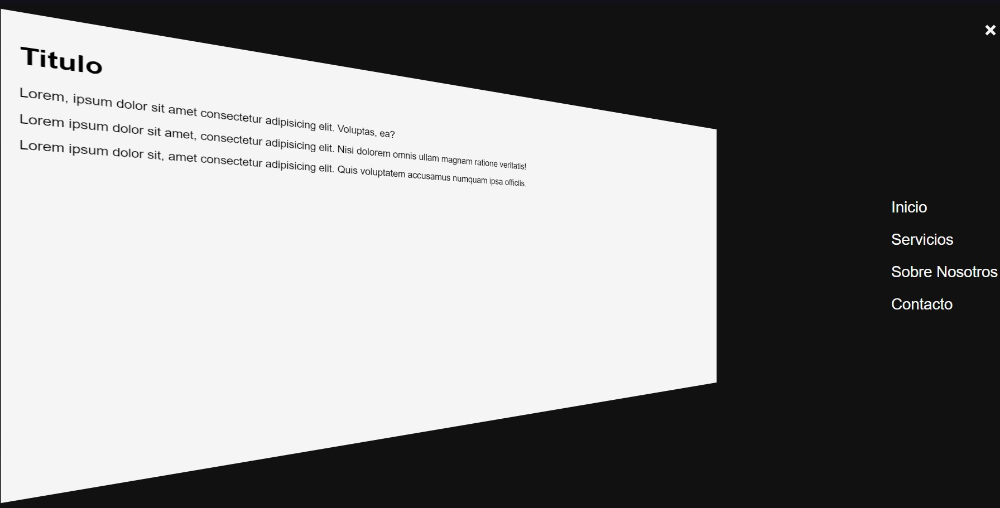
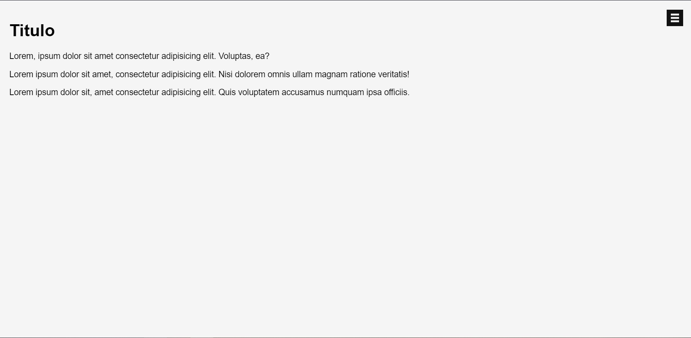

# Menu-lateral-de-Efecto-3D-desplegable
Un Menú oculto con un efecto desplegable 3D para nuestras paginas web, hecho en HTML, CSS y JavaScript

  
    
  
    
  
  

## ¿Cuál es el fin de este proyecto?
Es una simple pagina hecha en HTML, CSS y JavaScript. 
Su objetivo no es mas que el aprendisaje y practica de herramientas que nos puede proporcionar JavaScript.

## ¿Puedo Probarlo en Linea? 
Si, Puedes probarlo en linea haciendo click [aqui](https://carlosorellana00.github.io/Menu-lateral-de-Efecto-3D-desplegable/)

## ¿Cómo puedo probarlo de manera local en mi equipo?
puede copiarse directamente desde git a traves de comando o descargarse en un archivo Zip, el proyecto no requiere de ningun servicio de servidor para correrse
de manera local en una computadora.

## Modo de uso

el modo de uso es bastante simple y es practicamente un ejemplo de forma practica ya que solo cuenta con una función, la forma de hacerlo funcinar es simplemente el
presionar el icono de menu en la esquina izquierda de la pantalla.

  

al presionarlo en ves de desplegarse un menú lateral, nuestra vista de la pagia se ladea y es la que nos presenta el menú oculto en la esquina, teniendo un efecto 
algo diferente a los clasicos menús de siempre

  

## Agradecimientos y Referencias:

- [Autor -> Codingflag](https://www.youtube.com/c/Codingflag)
- [Video Original -> 3D OffCanvas Sidebar Navigation using HTML, CSS & JavaScript.](https://www.youtube.com/watch?v=45F3MMAOmYA&t=2s)

